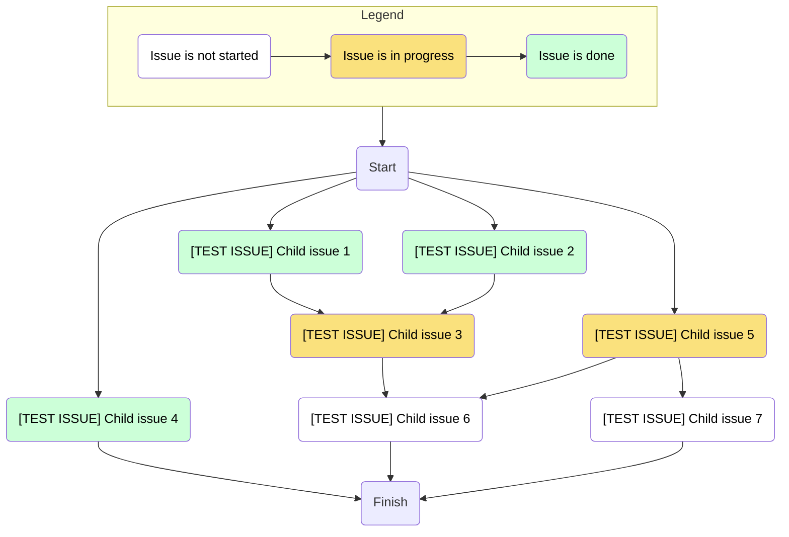

# maxim-lobanov/build-issue-dependencies-graph

This action is intended for building dependencies graph between issues in epic, rendering mermaid diagram with this graph and automatically updating epic issue body with diagram.
It can be useful during work on big epics where it is tricky to keep all dependencies in mind.

All nodes of diagram are clickable and link leads to issue page. Also nodes are colored according to issue status: Green (issue is closed), Yellow (issue is opened and someone is assigned to it), White (issue is opened and no assignees). 

## Parameters
| Parameter | Description |
|-|-|
| `root-issue-url` | Url of the root issue |
| `section-title` | Title of markdown section where mermaid chart should be placed |
| `github-token` | GitHub API Token with read and write access to root issue and read access to all issues in the tasklist |
| `include-legend` | Set this option to include legend to mermaid diagram |
| `include-finish-node` | Set this option to include finish node to mermaid diagram |
| `dry-run` | Set this option to not update root issue with updated mermaid diagram and only print new diagram to output |

## Usage

1. Update root issue body to include task list with all children issues:
    ```
    - [ ] https://github.com/owner/repo/issues/2
    - [ ] https://github.com/owner/repo/issues/3
    - [ ] https://github.com/owner/repo/issues/4
    ...
    ```
2. Create an empty section in root issue body to which mermaid diagram will be inserted:
    ```
    ...
    ## Spec Diagram
    ...
    ```
3. Update all children issues to define their dependencies in issues body using one of the following syntax:
    ```
    Depends on https://github.com/owner/repo/issues/2, https://github.com/owner/repo/issues/3
    Depends on: https://github.com/owner/repo/issues/2 https://github.com/owner/repo/issues/3
    Dependencies: https://github.com/owner/repo/issues/2, https://github.com/owner/repo/issues/3
    ```
    Any of the format above can be used one or multiple times in issue body. Any separator can be used for issues in line.

4. Add workflow to invoke this action:
    ```yml
    jobs:
      update-diagram:
        runs-on: ubuntu-latest
        steps:
          - uses: maxim-lobanov/build-issue-dependencies-graph@v1
            with:
              root-issue-url: 'https://github.com/owner/repo/issues/1'
              section-title: 'Spec Diagram'
              github-token: '${{ secrets.GITHUB_TOKEN }}'
              include-legend: true
              include-finish-node: true
    ```

## Advanced usage

### Workflow to trigger action on schedule
```
on:
  schedule:
    - cron: '0 */12 * * *' # Twice per day

jobs:
  run:
    runs-on: ubuntu-latest
    strategy:
      fail-fast: false
      matrix:
        include:
          - root-issue-url: 'https://github.com/owner/repo/issues/1'
            section-title: 'Spec Diagram'
          - root-issue-url: 'https://github.com/owner/repo/issues/2'
            section-title: 'Spec Diagram'
    steps:
      - uses: maxim-lobanov/build-issue-dependencies-graph@v1
        name: 'Build issues dependency graph'
        id: build-issue-dependencies-graph
        with:
          root-issue-url: '${{ matrix.root-issue-url }}'
          section-title: '${{ matrix.section-title }}'
          github-token: '${{ secrets.GITHUB_TOKEN }}'
          include-legend: true
          include-finish-node: true
```

### Workflow to trigger action manually
```yml
on:
  workflow_dispatch:
    inputs:
      root-issue-url:
        description: 'Root issue url'
        required: true
        type: string
      section-title:
        description: 'Section title'
        required: true
        type: string
      include-legend:
        description: 'Include legend'
        type: boolean
      include-finish-node:
        description: 'Include finish node'
        type: boolean
      dry-run: 
        description: 'Dry run'
        type: boolean

jobs:
  run:
    runs-on: ubuntu-latest
    steps:
    - uses: maxim-lobanov/build-issue-dependencies-graph@v1
      name: 'Build issues dependency graph'
      id: build-issue-dependencies-graph
      with:
        root-issue-url: '${{ github.event.inputs.root-issue-url }}'
        section-title: '${{ github.event.inputs.section-title }}'
        github-token: '${{ secrets.GITHUB_TOKEN }}'
        include-legend: '${{ github.event.inputs.include-legend }}'
        include-finish-node: '${{ github.event.inputs.include-finish-node }}'
        dry-run: '${{ github.event.inputs.dry-run }}'
    
    - run: |
        cat << 'EOF' > $GITHUB_STEP_SUMMARY
        ${{ steps.build-issue-dependencies-graph.outputs.mermaid-diagram }}
        EOF
```

## Mermaid examples


